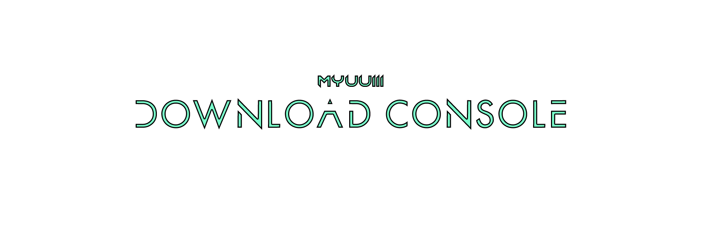

# Functions to be implemented before release
- [x] Download songs from spotofy
- [x] Download songs from youtube
- [x] Download videos from youtube
- [x] Download songs from SoundCloud
- [ ] Edit the application configuration inside of the app